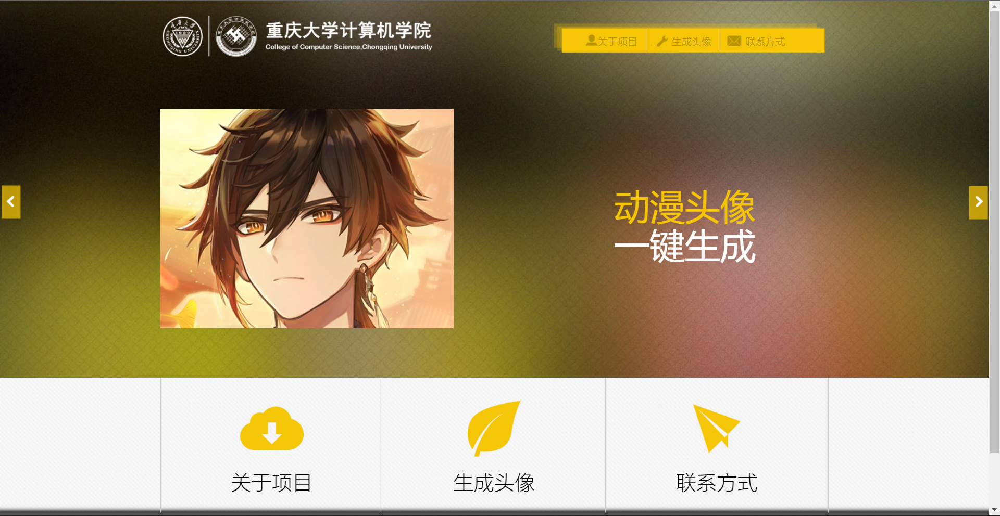
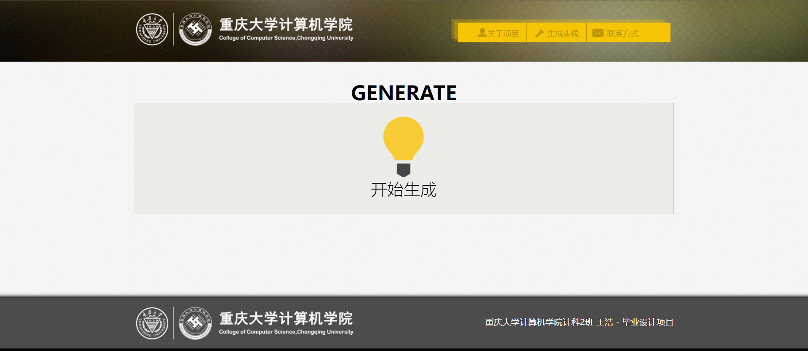
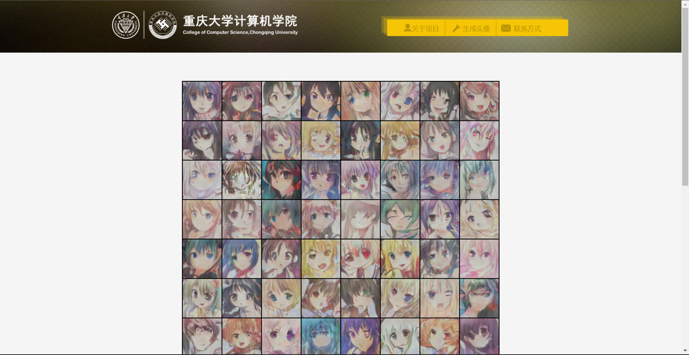

# 基于DCGAN的二次元头像生成

## 项目简介

本项目是我本科期间的毕业设计项目（重庆大学-计算机科学与技术）。项目是基于Pytorch框架的，实现DCGAN的二次元头像自动生成。这个课题本身在github或其他地方都有很多实现，但是我没有找到实现了网页可视化的完整项目代码。本项目简单更改了一个网页模板，和后端的生成头像功能结合了一下。目前模型只训练了500个epoch，生成的图片质量一般。个人水平有限，项目很多地方都很粗糙，也做了很多参考，欢迎大佬指正。

## 环境配置

- GPU NVIDIA RTX 3060
- CUDA11.3+cudnn
- PyCharm Community Edition 2022
- Anaconda 3 及对应版本Pytorch
- 网页框架使用Flask

## 网页效果展示

### 参考

http://t.csdn.cn/SzrtD

https://github.com/chgex/Anime-Avatar

https://github.com/pytorch/examples/tree/main/dcgan

数据集来自：https://blog.csdn.net/docoter_c/article/details/116644882
